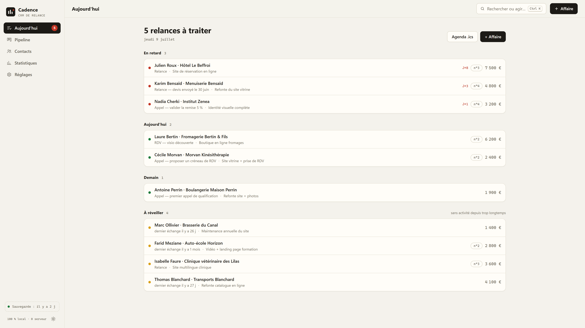
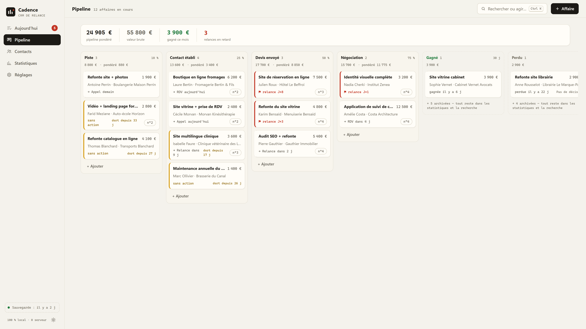
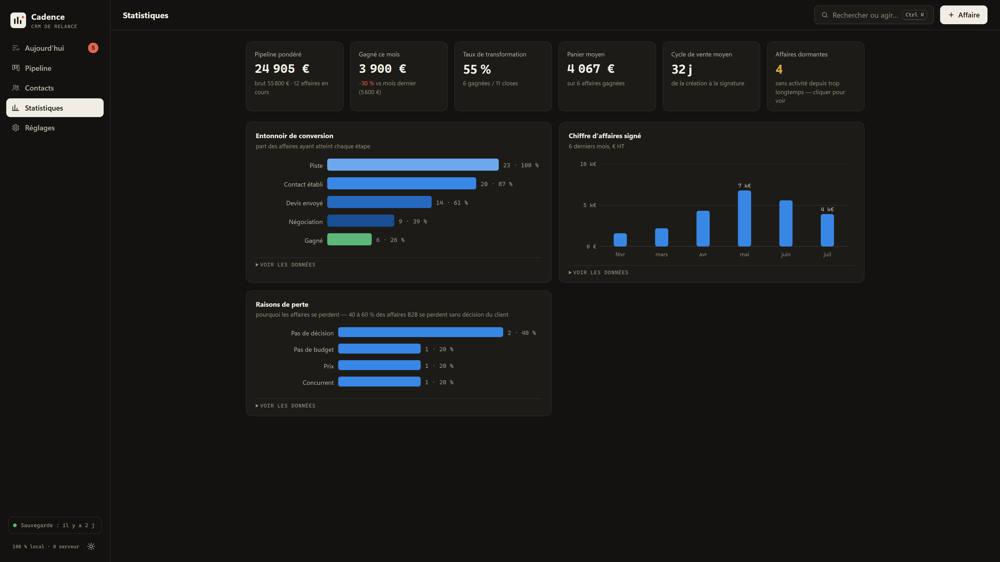
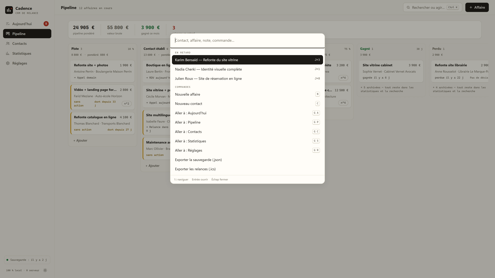

# Cadence — CRM de relance

Un CRM complet dans **un seul fichier HTML**. Zéro serveur, zéro compte, zéro dépendance, zéro build.
Ouvrez `index.html` dans un navigateur : c'est installé.

**Démo en ligne : [mario-mto.github.io/cadence-crm/?demo=1](https://mario-mto.github.io/cadence-crm/?demo=1)** — données d'exemple pré-chargées, rien ne quitte votre navigateur.



Construit comme démonstration de ce que produit une session avec **Claude Fable 5** quand on lui demande
un outil réellement utilisable en entreprise — pas une maquette.

## Le parti pris

Le produit est construit sur un constat documenté : **80 % des ventes B2B se signent entre la 5ᵉ et la
12ᵉ relance, mais 44 % des commerciaux s'arrêtent à la première.** Cadence n'est donc pas une base de
contacts avec un pipeline autour — c'est un moteur de relance :

- L'écran d'accueil n'est pas un dashboard : c'est la liste **« À relancer aujourd'hui »** (en retard,
  aujourd'hui, demain), avec `Fait` / `Reporter` en un clic.
- Chaque affaire porte une **prochaine action datée**, pré-remplie par défaut — jamais imposée par une
  modale bloquante. Une affaire sans action est un état visuellement anormal.
- Marquer une action « faite » consigne l'échange dans le fil et propose la suivante **en une frappe**
  (Entrée). La discipline par le nudge, pas par le mur.
- Le compteur **« relance n°X »** sur chaque carte rappelle qu'on n'en est qu'à la 2ᵉ sur les 5
  nécessaires.

## Fonctionnalités

| Domaine | Détail |
|---|---|
| Pipeline kanban | 5 étapes en français (Piste → Contact établi → Devis envoyé → Négociation → Gagné/Perdu), drag & drop, probabilités par étape éditables |
| Pondération | Pipeline pondéré façon Pipedrive : probabilité de l'affaire > probabilité de l'étape ; totaux brut/pondéré par colonne |
| Affaires dormantes | Seuil d'inactivité par étape ; une action planifiée à ≤ 7 jours suspend l'alerte (le défaut le plus reproché à Pipedrive, corrigé) |
| Cadence devis | Passage en « Devis envoyé » → relances suggérées à J+3, J+7, J+14 (un devis relancé convertit à 40 % contre 15 % sans relance) |
| Raisons de perte | Choix en un clic à la clôture ; rapport dédié (40-60 % des affaires B2B se perdent « sans décision ») |
| Timeline | Fil horodaté par affaire (notes, appels, emails, RDV, changements d'étape), agrégé sur la fiche contact |
| Recherche | Ctrl+K : contacts, affaires, notes et commandes, insensible aux accents, 100 % clavier |
| Vue contacts | Table avec édition inline (clic, Entrée, Tab), tags, actions groupées, détection de doublons |
| Import Excel | Copier-coller direct depuis Excel/Sheets ou fichier .csv : encodage détecté (UTF-8/Windows-1252), colonnes devinées, zéros des téléphones restaurés, prévisualisation obligatoire |
| Exports | Sauvegarde .json datée, CSV contacts/affaires (BOM + point-virgule : s'ouvre proprement dans Excel FR), relances → agenda .ics |
| Statistiques | 6 tuiles fixes + entonnoir de conversion + CA mensuel + raisons de perte — chaque stat masquée sous un seuil de données (jamais de NaN) |
| RGPD | Données 100 % locales (localStorage), détection des contacts inactifs 3 ans+ avec purge en un clic (recommandation CNIL) |
| Divers | Thème clair/sombre, raccourcis clavier (N, C, G+lettre, /), annulation des suppressions, synchronisation entre onglets, responsive mobile |

## Limites assumées (documentées dans l'app)

Mono-utilisateur, mono-appareil. Pas de notification fichier fermé (d'où l'export .ics).
Données en clair dans le navigateur du poste. La sauvegarde régulière n'est pas optionnelle —
l'app le rappelle et affiche en permanence la date de la dernière sauvegarde.

## Lancer

```
# double-clic sur index.html, ou :
python -m http.server 8781 --directory cadence-crm
```

Au premier lancement : données d'exemple, base vide, ou import de votre fichier Excel.

Liens de démo : `?demo=1` charge les données d'exemple (uniquement si la base est vide),
`?theme=dark|light` force le thème, `?capture=palette` ouvre la recherche Ctrl+K.
Exemple : `index.html?demo=1&theme=dark#/stats`.

## Captures

| Pipeline | Statistiques (thème sombre) |
|---|---|
|  |  |



---

*Design : couleur = signal (rouge : à traiter, ambre : s'endort, vert : gagné), l'encre fait le reste.
Palette des graphiques validée par calcul (contraste, daltonisme). Aucune bibliothèque.*
